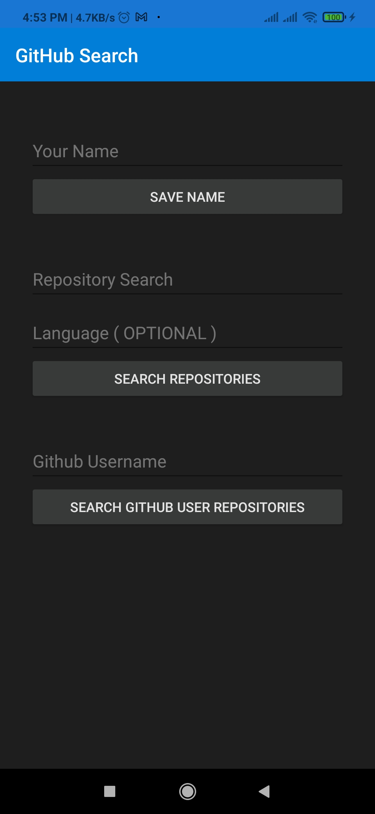
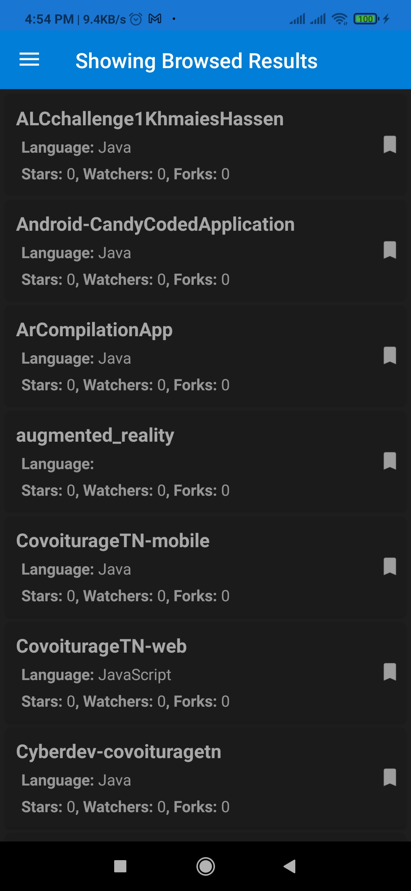
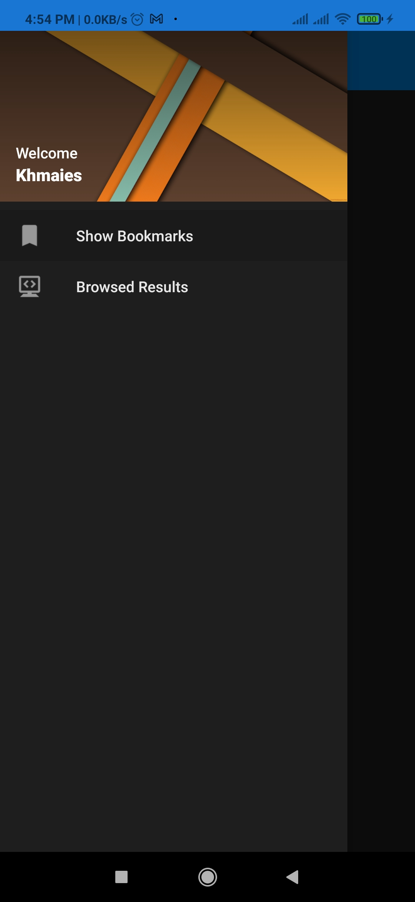
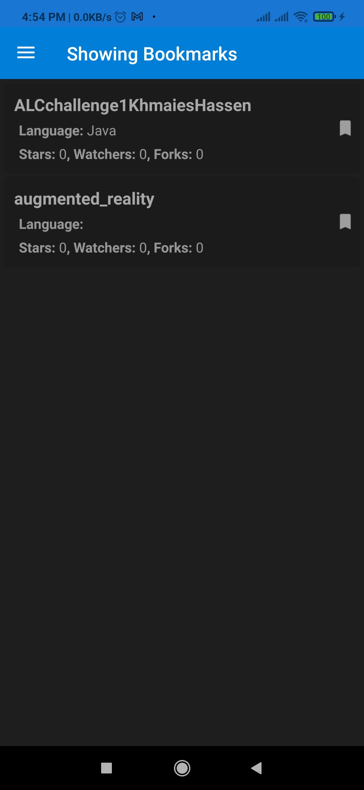

  <h3 align="center">Kotlin Android Github search</h3>

<!-- ABOUT THE PROJECT -->
## About The Project
Kotlin learning project were i created a Kotlin android app that allows the user to search github for repos by username, repo name and programming language also the user have the ability to bookmark a repo so that it can be save to Realm 

* Retrofit
* Realm
* Kotlin

<!-- ScreenShots -->
## Screenshots
    
    
    
    

